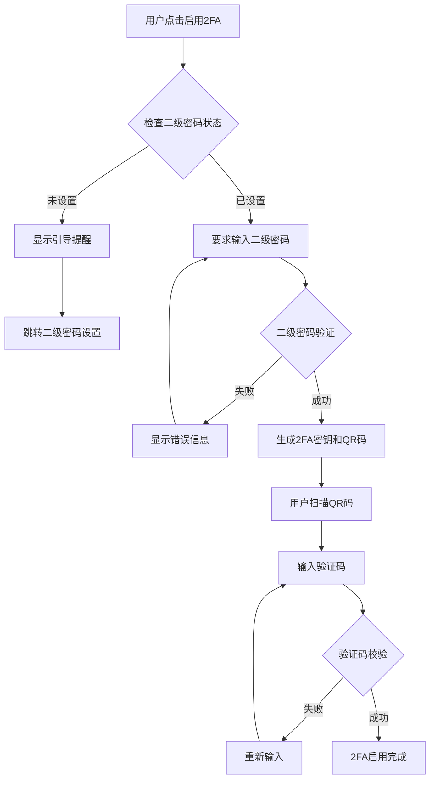

# Security Components

## 📁 文件结构

```
src/pages/security/
├── components/
│   ├── TwoFactorAuthComponent.tsx     # 通用2FA组件 ♻️
│   ├── PasswordSettings.tsx           # 密码设置组件
│   ├── SecondaryPasswordSettings.tsx  # 二级密码设置组件
│   ├── index.ts                       # 组件导出
│   └── README.md                      # 说明文档
├── TwoFactorAuthPage.tsx              # 2FA独立页面 (使用组件)
├── PasswordUpdatePage.tsx             # 密码更新页面 (使用组件)
├── SecondaryPasswordUpdatePage.tsx    # 二级密码更新页面 (使用组件)
└── index.ts                           # 页面导出
```

## 🧩 组件设计

### **1. TwoFactorAuthComponent** - 通用2FA组件 ♻️

高度可配置的2FA组件，可以在不同场景下复用。

#### **🆕 重要安全流程变更**

**变更内容:**
- **验证方式**: 从登录密码验证改为二级密码验证
- **前置条件**: 必须先设置二级密码才能启用2FA
- **智能引导**: 未设置二级密码时提供跳转引导
- **上下文感知**: 根据使用场景提供不同的跳转行为

**安全逻辑:**
1. 用户点击"启用2FA" → 检查是否已设置二级密码
2. 如未设置 → 显示提醒并引导到二级密码设置
3. 如已设置 → 要求输入二级密码验证身份
4. 验证通过 → 生成QR码，进入扫描步骤
5. 完成验证 → 2FA启用成功

#### **主要特性**

1. **完整功能**
   - 2FA启用/禁用
   - QR码生成和显示  
   - 手动密钥输入
   - TOTP验证码验证
   - 备份码管理
   - 状态同步
   - **🆕 二级密码验证**
   - **🆕 前置条件检查**

2. **高度可配置**
   ```tsx
   interface TwoFactorAuthComponentProps {
     // 基础属性
     tenantInfo?: TenantInfo | null
     loading?: boolean
     onUpdate?: () => void
     
     // 样式控制
     showCard?: boolean           // 是否显示外层卡片
     showHeader?: boolean         // 是否显示标题头部  
     showSteps?: boolean         // 是否显示步骤指示器
     showStatusAlerts?: boolean  // 是否显示状态提醒
     
     // 自定义样式
     cardProps?: any
     className?: string
     
     // 🆕 跳转控制
     context?: 'security' | 'settings'     // 组件使用上下文
     onTabChange?: (tabKey: string) => void // 标签页切换回调
   }
   ```

3. **🆕 上下文感知跳转**
   - **security上下文**: 直接跳转到 `/security/secondary-password`
   - **settings上下文**: 切换到"二级密码"标签页

#### **使用示例**

```tsx
// 1. 独立页面使用 (security/TwoFactorAuthPage)
<TwoFactorAuthComponent 
  showCard={true}
  showHeader={false}
  showSteps={true}
  showStatusAlerts={true}
  context="security"  // 指定security上下文
/>

// 2. 设置页面标签页使用 (settings/ProfilePage)  
<TwoFactorAuthComponent 
  tenantInfo={tenantInfo}
  loading={loading}
  onUpdate={loadTenantInfo}
  context="settings"       // 指定settings上下文
  onTabChange={setActiveTab}  // 支持标签页切换
  showCard={true}
  showHeader={true}
  showSteps={true}
  showStatusAlerts={true}
/>
```

### **2. PasswordSettings** - 密码设置组件

通用的主密码设置组件，可在多个页面复用。

#### **主要特性**

1. **完整功能**
   - 当前密码输入
   - 新密码输入和确认
   - 密码状态显示
   - 密码要求提示
   - 表单验证

2. **组件接口**
   ```tsx
   interface PasswordSettingsProps {
     passwordData: PasswordFormData
     setPasswordData: React.Dispatch<React.SetStateAction<PasswordFormData>>
     loading: boolean
     tenantInfo: TenantInfo | null
     onUpdate: () => void
   }
   ```

3. **使用场景**
   - 独立密码设置页面 (`/security/password`)
   - ProfilePage中的密码设置标签页 (`/settings/profile`)

### **3. SecondaryPasswordSettings** - 二级密码设置组件

通用的二级密码设置组件，支持新建和更新两种模式。

#### **主要特性**

1. **智能表单模式**
   - 自动检测是新建还是更新二级密码
   - 条件显示"当前二级密码"字段
   - 动态调整表单标签和提示

2. **安全状态显示**
   - 二级密码状态标签
   - 2FA状态提示
   - 安全建议提醒

3. **组件接口**
   ```tsx
   interface SecondaryPasswordSettingsProps {
     secondaryPasswordData: SecondaryPasswordFormData
     setSecondaryPasswordData: React.Dispatch<React.SetStateAction<SecondaryPasswordFormData>>
     loading: boolean
     tenantInfo: TenantInfo | null
     onUpdate: () => void
   }
   ```

## 🔒 **2FA安全流程详解**

### **新的安全架构**



### **前置条件检查**

1. **二级密码状态检查**
   ```tsx
   if (!tenantInfo?.hasSecondaryPassword) {
     // 显示引导提醒，跳转到二级密码设置
   }
   ```

2. **智能跳转逻辑**
   ```tsx
   const handleNavigateToSecondaryPassword = () => {
     if (context === 'settings') {
       // 切换到二级密码标签页
       onTabChange?.('secondary-password')
     } else {
       // 跳转到独立的二级密码设置页面
       window.location.href = '/security/secondary-password'
     }
   }
   ```

### **用户体验优化**

1. **清晰的状态提示**
   - 前置条件提醒卡片
   - 二级密码状态显示
   - 启用流程说明

2. **智能引导**
   - 一键跳转到二级密码设置
   - 上下文感知的跳转行为
   - 设置完成后自动返回提示

3. **安全验证**
   - 二级密码身份验证
   - 防止未授权启用2FA
   - 多层安全保护

## 🎯 重构优势

### **1. 增强的安全性**

**改进前:**
- ❌ 使用登录密码验证启用2FA
- ❌ 安全层级不够清晰
- ❌ 容易被恶意启用

**改进后:**
- ✅ 使用二级密码验证启用2FA
- ✅ 明确的安全层级设计
- ✅ 二级密码 → 2FA 的安全升级路径
- ✅ 防止未授权启用

### **2. 更好的用户体验**

- **智能引导**: 自动检测前置条件并引导用户
- **上下文感知**: 根据使用场景提供最佳跳转方式
- **流程清晰**: 明确的步骤指示和状态提醒
- **一键设置**: 快速跳转到相关设置页面

### **3. 系统架构优化**

- **逻辑一致**: 所有安全功能遵循统一的验证逻辑
- **模块化**: 组件间职责清晰，易于维护
- **可扩展**: 为未来的安全功能扩展奠定基础

## 🔄 迁移指南

### **API变更**

**twoFAService.create2FA 参数变更:**
```tsx
// 改进前
create2FA: async (data: {
  enabled: boolean
  password?: string  // 登录密码
  // ...
})

// 改进后  
create2FA: async (data: {
  enabled: boolean
  secondaryPassword?: string  // 二级密码
  // ...
})
```

### **对于现有代码**

1. **独立2FA页面** (`/security/2fa`)
   - ✅ 自动使用新流程
   - ✅ 支持智能跳转
   - ✅ 前置条件检查

2. **设置页面中的2FA** (`/settings/profile`)  
   - ✅ 自动使用新流程
   - ✅ 支持标签页切换
   - ✅ 无缝用户体验

### **用户操作流程**

1. **首次启用2FA**
   ```
   用户进入2FA设置 → 检查二级密码 → 引导设置二级密码 → 返回启用2FA
   ```

2. **已有二级密码**
   ```
   用户进入2FA设置 → 输入二级密码 → 扫描QR码 → 验证成功
   ```

## 🛡️ 安全特性

### **多层安全验证**
- **第一层**: 登录密码 (账户访问)
- **第二层**: 二级密码 (重要操作验证)
- **第三层**: 2FA (双因素认证)

### **安全升级路径**
1. 用户注册/登录 (登录密码)
2. 设置二级密码 (增强安全)
3. 启用2FA (最高安全等级)

### **防护机制**
- **身份验证**: 二级密码验证身份
- **前置检查**: 确保安全基础设施完整
- **状态监控**: 实时显示安全配置状态
- **智能引导**: 帮助用户完成安全设置

## 🎨 设计一致性

- **遵循Ant Design设计规范**
- **与ProfilePage风格统一**
- **响应式布局设计**
- **专业的金融平台配色**
- **清晰的信息层次**
- **统一的卡片样式和间距**

## 📈 性能优化

- **按需加载**: 组件只在需要时加载
- **状态外置**: 避免不必要的内部状态
- **回调优化**: 减少不必要的重新渲染
- **代码分割**: 组件可以独立打包

## 🚀 未来扩展

这种组件化架构为未来功能扩展提供了良好基础：

1. **新的安全组件**
   - API密钥管理组件
   - 登录历史组件
   - 设备管理组件

2. **安全功能增强**
   - 生物识别验证
   - 硬件密钥支持
   - 风险评估系统

3. **用户体验优化**
   - 渐进式安全设置向导
   - 个性化安全建议
   - 安全状态仪表板

这种重构不仅解决了代码重复问题，还建立了更加安全、用户友好的2FA启用流程，为用户提供了清晰的安全升级路径！ 